## Project Goal:

To integrate a Tomcat server with the CI/CD pipeline and deploy artifacts into the server.

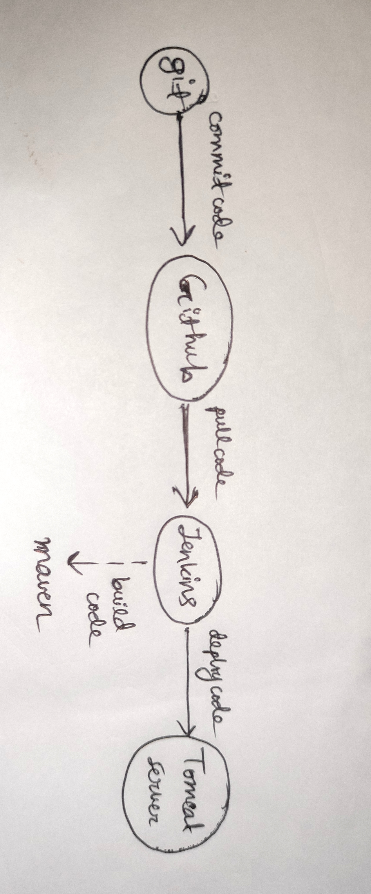
## Source Code:

The source code is taken from https://github.com/Saptaktdk/hello-world
## Setting up the Tomcat Server:

* First, an ec2 instance is created for the tomcat server:

* Used MobaXterm to create a remote session.

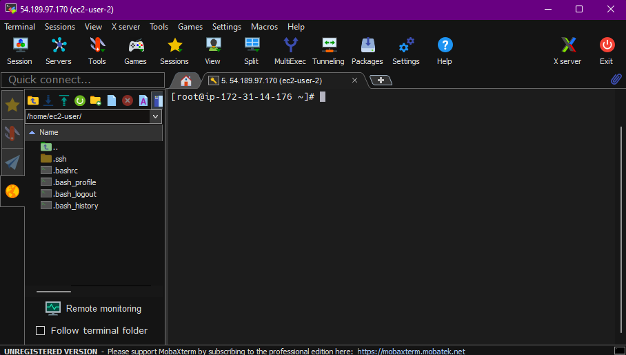

* Tomcat Installation guide: https://github.com/yankils/Simple-DevOps-Project/blob/master/Tomcat/tomcat_installation.MD

* To start the Tomcat services do startup.sh.

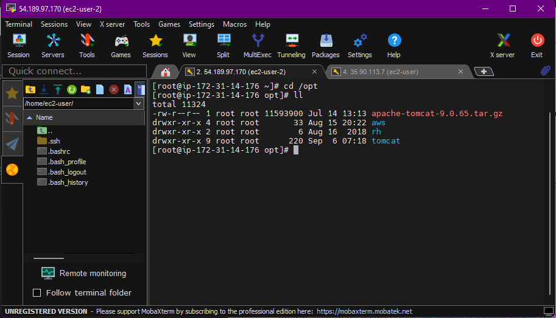

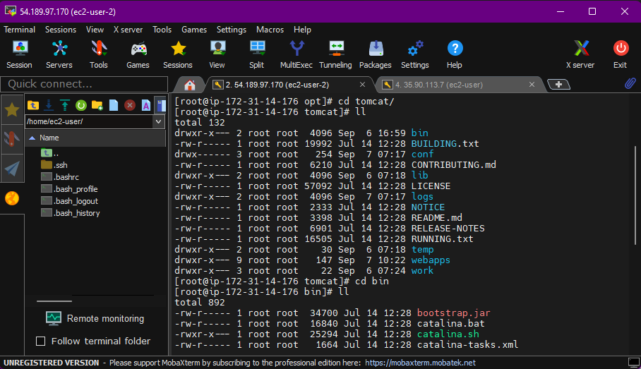

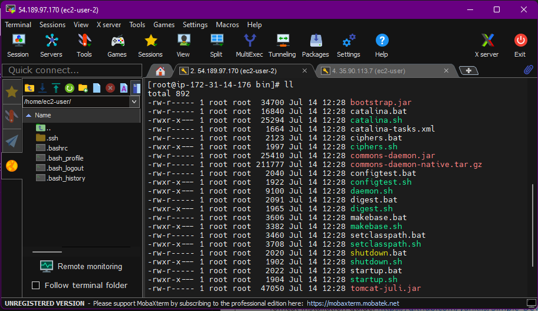

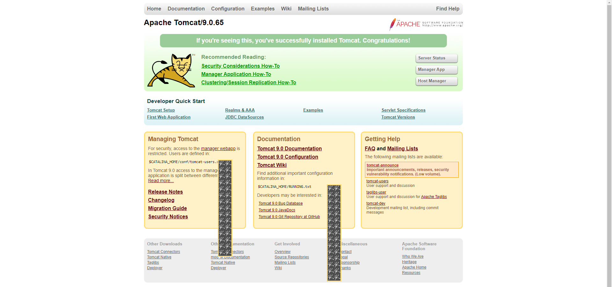
## Integrating Tomcat with Jenkins:

* Installed Deploy to container pluggin.

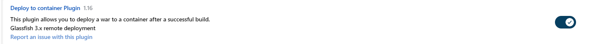

* Made a maven project that can make the build and deployment on Tomcat Server.

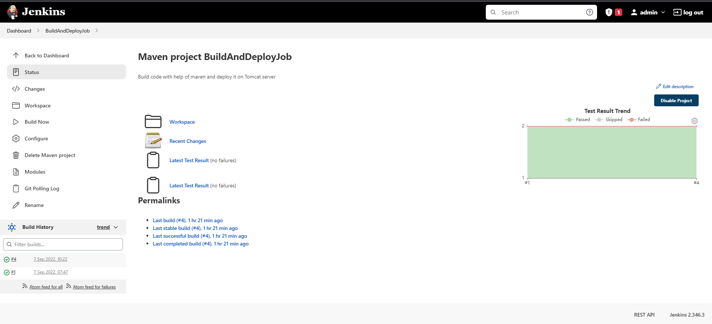

* Opening the Tomcat Server:

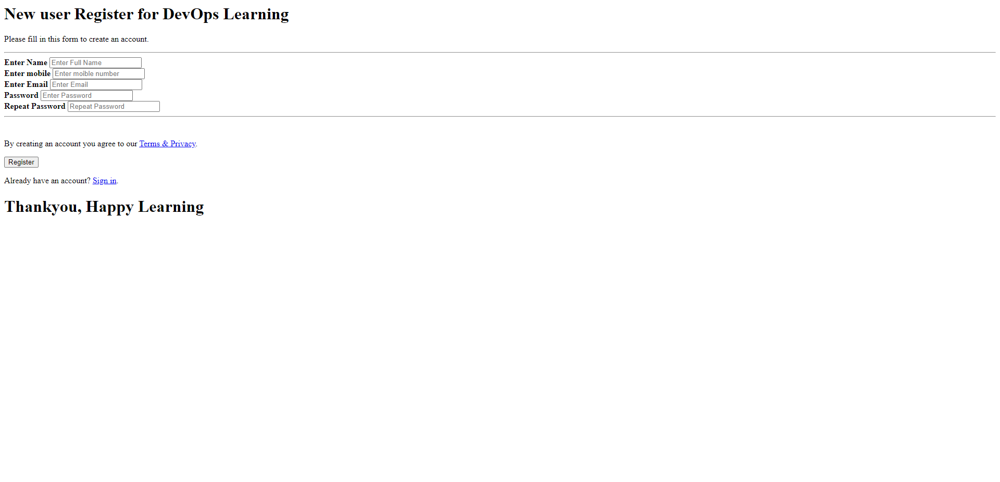

## Automating the build and deploy using Poll SCM:

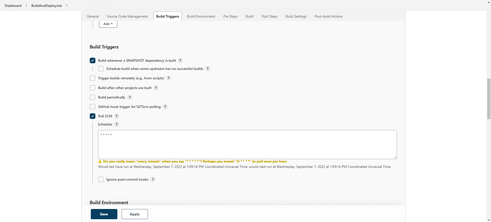

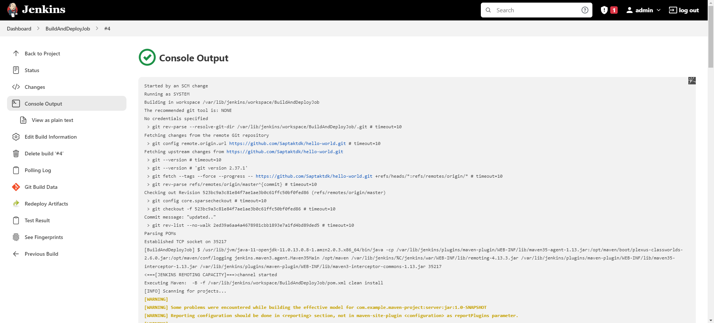